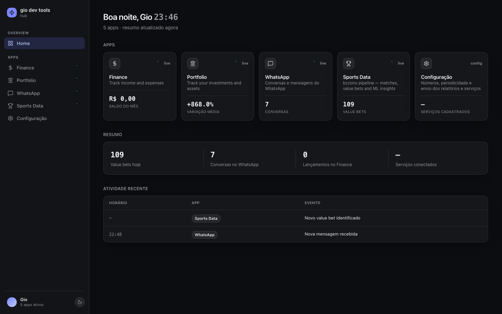
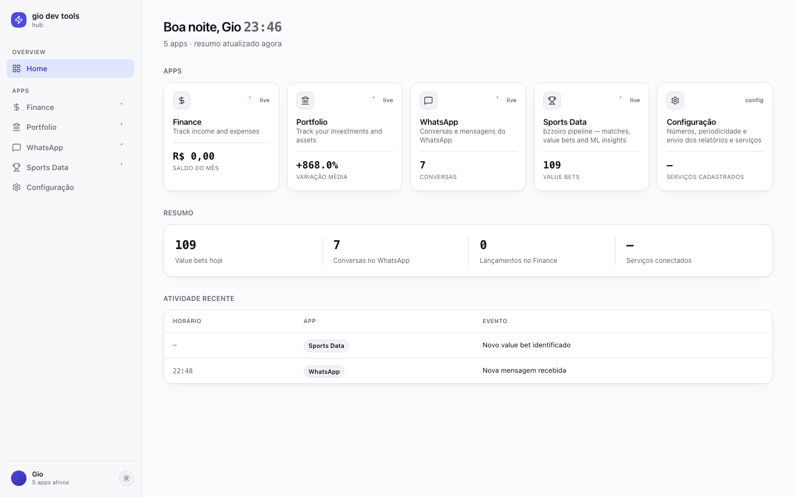
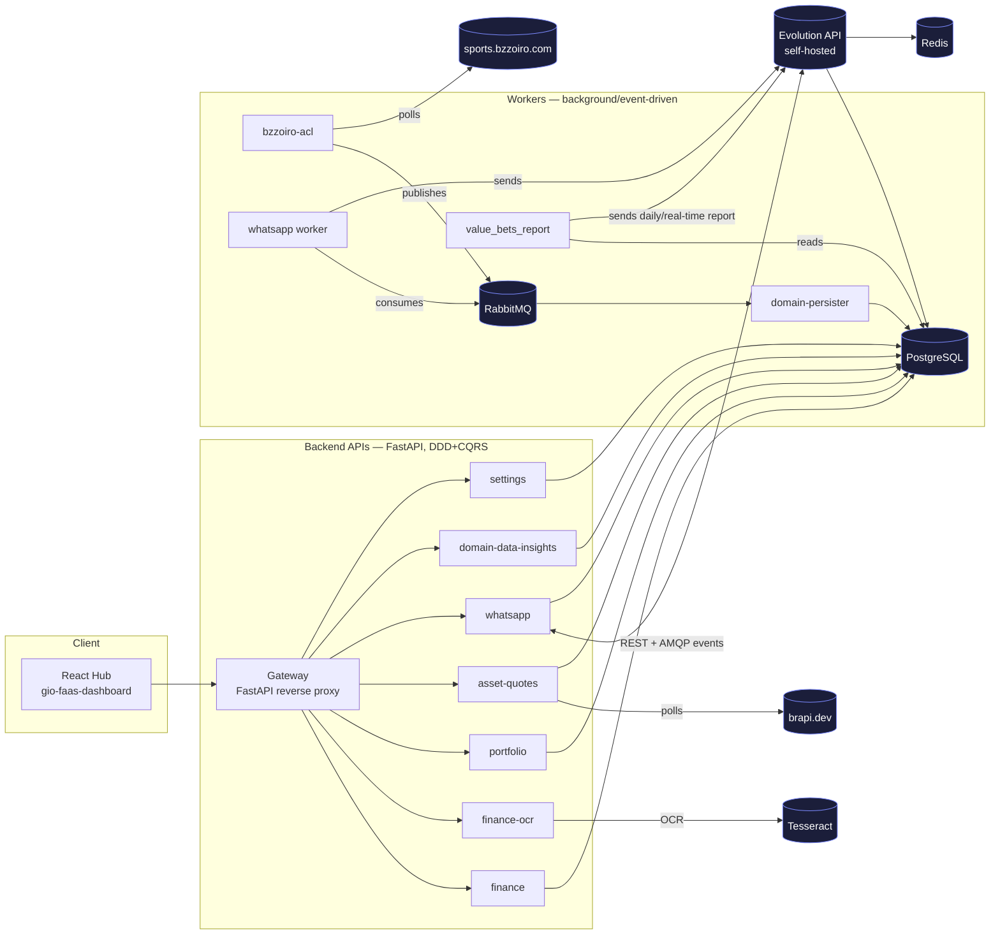

# gio dev tools

A personal, self-hosted platform: WhatsApp automation, finance tracking, investment
portfolio management, and a sports-betting value-bet pipeline, all running on one
small server that I own end to end — infra, deploy, and code.

<p align="center">
  
  
</p>

## What's actually in here

| Domain | What it does |
|---|---|
| **Finance** | Income/expense tracking, with receipt OCR (Tesseract) so you can photograph a note instead of typing it in |
| **Portfolio** | Investment tracking (CDB, FII, stocks, treasury, crypto...) with live quotes pulled from B3 via [Brapi](https://brapi.dev) |
| **WhatsApp** | A real inbox — send/receive messages through a self-hosted [Evolution API](https://github.com/EvolutionAPI/evolution-api) instance, no third-party SaaS in the loop |
| **Sports Data** | An event-driven pipeline that pulls football data from [bzzoiro](https://sports.bzzoiro.com), computes value bets against bookmaker odds, and generates ML-assisted match insights |
| **Configuração** | Where the operational knobs live — report schedule, recipients, alert thresholds, and a registry of which service uses which credential (referenced, not stored — secrets live in Infisical) |

Everything above is a real, running service — not a demo. The frontend is a single hub
(`src/frontend/gio-faas-dashboard`) that ties all of it together behind one sidebar.

## Architecture



- **Frontend → Gateway → services**: the gateway (`src/backend/api/gateway`) is the
  single entry point the frontend talks to; it proxies `/finance/*`, `/portfolio/*`,
  `/whatsapp/*`, `/domain-data-insights/*`, `/settings/*`, etc. to the matching
  internal service over the private Docker network.
- **Event-driven sports pipeline**: `bzzoiro-acl` polls the bzzoiro API on a schedule
  per data type (live scores every 30s, odds every 60s, fixtures every 5min...),
  translates payloads into domain events, and publishes them to RabbitMQ.
  `domain-persister` consumes those events and writes to Postgres — the two never
  talk to each other directly.
- **WhatsApp**: messages flow through a self-hosted Evolution API instance (not
  Meta's Business API), which publishes events to RabbitMQ that the `whatsapp`
  worker and API both consume.
- **Every backend service follows the same shape**: `domain/` (entities, value
  objects), `application/commands/` (one command + handler per use case),
  `infrastructure/` (repository + event bus), `app/` (FastAPI router/schemas/deps).
  See [Adding a service](docs/adding-a-service.md).

## Local development

```bash
# frontend
cd src/frontend/gio-faas-dashboard
npm install
npm run dev              # http://localhost:5173, talks to VITE_GATEWAY_URL

# a backend service (example: portfolio)
cd src/backend/api/portfolio
pip install -r requirements.txt -r requirements-dev.txt
PYTHONPATH=..:.. uvicorn app.main:app --reload
python -m behave --no-capture   # BDD suite, in-memory repo — no DB needed
```

Backend services need a real Postgres + secrets (via Infisical) to fully boot — the
BDD suites are written against in-memory repositories specifically so you don't need
either just to run the test suite.

## Infra & deploy

Everything runs as Docker Compose stacks, tracked in `src/infra/*.yml` and deployed
by [Dockhand](https://github.com/hyprnetwork/dockhand) watching this repo:

| Stack | Contains |
|---|---|
| `apis.yml` | finance, finance-ocr, asset-quotes, portfolio, whatsapp, domain-data-insights, settings |
| `workers.yml` | whatsapp-worker, bzzoiro-acl, domain-persister, value-bets-report |
| `utils.yml` | gateway, frontend, misc tooling |
| `persistence.yaml` | Postgres, Redis, RabbitMQ, WebDAV, Evolution API |
| `observability-stack.yml` | Grafana, Loki, OTel collector |

CI (`.github/workflows/deploy-*.yml`) detects which service directories changed on
push to `main`, builds only those images, runs BDD tests where present, pushes to a
private registry, and pings a Dockhand webhook to redeploy. See
[CI/CD](docs/ci-cd.md).

Secrets (DB URLs, API keys, tokens) are pulled at boot from Infisical — nothing
sensitive is committed. See [Secrets](docs/secrets.md).

## Docs

- [Architecture](docs/architecture.md) — full service inventory and data flow
- [Adding a service](docs/adding-a-service.md) — the DDD/CQRS pattern every API and worker follows
- [Gateway](docs/gateway.md) — routing, env vars, running it locally
- [CI/CD](docs/ci-cd.md) — how a push turns into a deploy
- [Secrets](docs/secrets.md) — what's stored where
- [bzzoiro API reference](docs/bzzoiro-docs.md) — the sports data provider's endpoints
