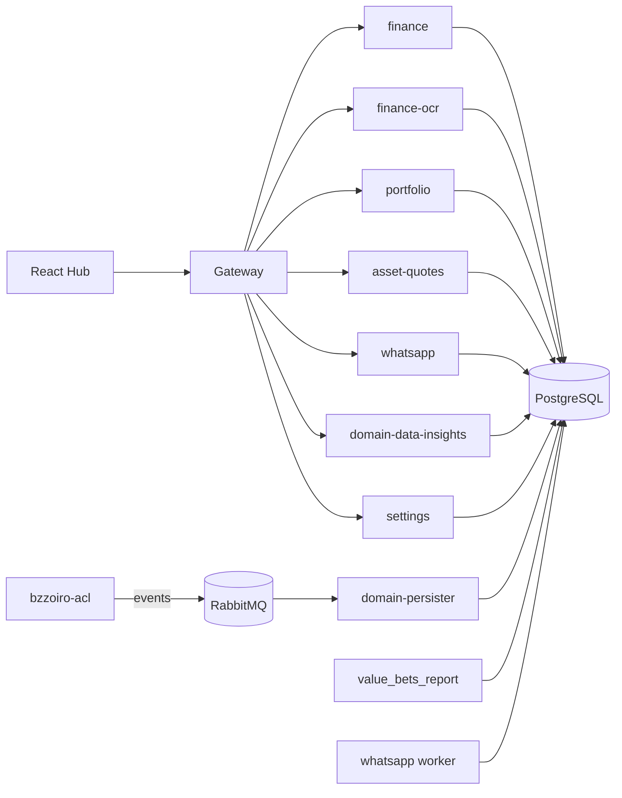

# Architecture

## Overview

See the [root README](../README.md#architecture) for the full diagram including
external providers (bzzoiro, Brapi, Evolution API) and Redis.

## Services

### Backend APIs (`src/backend/api/`)

Every API is a FastAPI app following the same internal layout — see
[Adding a service](adding-a-service.md) for the pattern in full.

| Service | Purpose | Notable dependency |
|---|---|---|
| `gateway` | Single entry point; proxies `/{service}/*` to the matching internal API | — |
| `finance` | Income/expense transactions | — |
| `finance-ocr` | Extracts transaction data from a photographed receipt | Tesseract (`pytesseract`) |
| `portfolio` | Investment/asset tracking | — |
| `asset-quotes` | Fetches and caches B3 quotes | [Brapi](https://brapi.dev) |
| `whatsapp` | Chat list, message history, send endpoint, SSE event stream | Evolution API |
| `domain-data-insights` | Read side for the sports-data pipeline (matches, value bets, ML insights) | — |
| `settings` | Service/credential registry + report scheduling config | — |

### Workers (`src/backend/worker/`)

Long-running processes with no (or minimal) HTTP surface — they poll external APIs
or consume queues on a loop.

| Worker | Purpose | Trigger |
|---|---|---|
| `bzzoiro-acl` | Polls bzzoiro per data type (fixtures, live scores, odds, lineups, standings...) on independent schedules, translates to domain events, publishes to RabbitMQ | Interval polling (`asyncio.sleep`) |
| `domain-persister` | Consumes bzzoiro-acl's events, writes to Postgres | RabbitMQ consumer |
| `value_bets_report` | Computes and sends the daily (or real-time, above an edge threshold) value-bets WhatsApp report | Cron-style schedule + RabbitMQ trigger |
| `whatsapp` (worker) | Background WhatsApp message processing | RabbitMQ consumer |

### Frontend (`src/frontend/gio-faas-dashboard`)

React + Vite + Tailwind v4. Client-side routes (`react-router`) map 1:1 to backend
domains: `/`, `/finance`, `/portfolio`, `/whatsapp`, `/sports-data`, `/settings`.
Design tokens (indigo accent, `--success`/`--warning`/`--destructive` semantic
colors) live in `src/index.css` and drive every screen via Tailwind's `@theme
inline`. Loading states use [boneyard-js](https://boneyard.vercel.app) — bones are
captured from the real rendered DOM via `npx boneyard-js build`, not hand-authored.

### Persistence (`src/infra/persistence.yaml`)

- **PostgreSQL** — the shared database; every service gets its own tables in one
  instance (no per-service DB, see `refactor: remove manual database bootstrap
  logic` in the git history for why)
- **RabbitMQ** — event bus between `bzzoiro-acl` → `domain-persister`, and between
  Evolution API → the WhatsApp worker/API
- **Redis** — cache for Evolution API
- **Evolution API** — self-hosted WhatsApp Business API alternative
- **WebDAV** — file storage

## Observability

Services are instrumented with `opentelemetry-instrument`, exporting traces to an
OTel collector (`observability-stack.yml`), visualized in Grafana with Loki for
logs. `bzzoiro-acl`'s `shared/auto_trace.py` wraps every method in `app`/`src` with
a span automatically — no manual instrumentation per function.

## Networking

All services sit on the same private Docker network (`persistence`, `apis`); the
gateway is the only one exposed to the frontend. Env vars follow a `{SERVICE}_URL`
convention (e.g. `PORTFOLIO_URL=http://portfolio:8000`) resolved via Docker's
internal DNS — container name = hostname.
